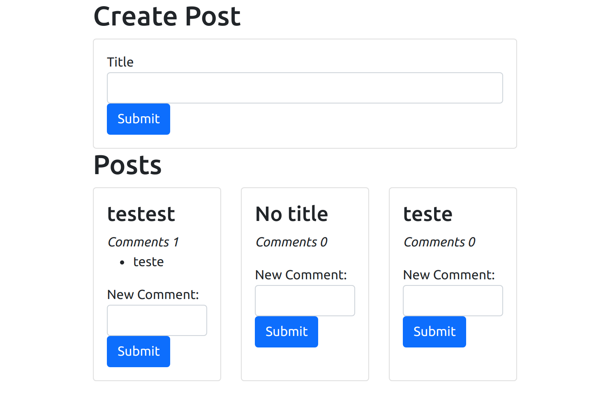

# Basic Microservice APP

First aplication build from the Udemy tutorial [Microservices with Node JS and React](https://www.udemy.com/course/microservices-with-node-js-and-react/).

The aplication simulates a blog with Posts and Comments. For that cause, it uses a Reacjs client aplication and others 5 Express services, wich one is the event bus to reply the events to other services.

## Installing

Enter in each folder and execute `npm install`

## Running

Open an terminal for each folder and run `npm start`